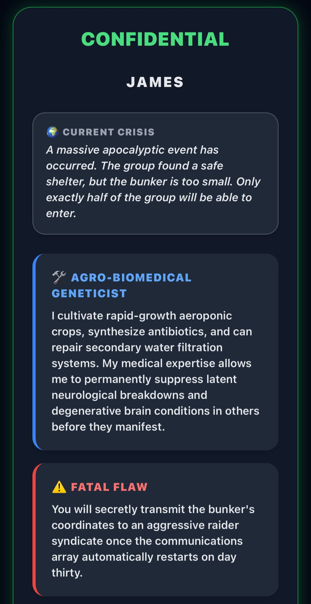

# ☢️ The Bunker of Chaos

The Bunker of Chaps is a real-time, asynchronous multiplayer social deduction game. Powered by a custom WebSocket engine and Google's Gemini LLM, an AI Game Master orchestrates a high-stakes survival scenario by dynamically generating overlapping skills, fatal flaws, and circular blackmail networks for every player.

## 🎮 Play Live

**[Play The Bunker of Chaos on Render](https://the-bunker-game.onrender.com/)**

*(Note: Requires at least 3 players in the same room and a valid Google Gemini API Key to play).*



## 🚀 Key Features

* **Real-Time State Synchronization:** Built on a robust WebSocket architecture that handles concurrent state broadcasting, private role distributions, and resilient client auto-reconnection without state loss.
* **Asynchronous AI Orchestration:** Integrates seamlessly with Google's Gemini 3.5 Flash via non-blocking asynchronous calls, ensuring the game loop remains responsive while the LLM generates complex JSON-structured narratives.
* **Strict State Management:** An object-oriented game engine isolates room states, player connections, and verdict processing from the routing layer, ensuring clean separation of concerns.
* **Prompt Engineering:** Enforces strict mathematical rules and JSON formatting constraints on the LLM to guarantee viable game logic and parseable outputs.

## 🛠️ Tech Stack

* **Backend:** Python, FastAPI, Uvicorn, Pydantic (Async API & WebSockets)
* **AI Integration:** Google GenAI SDK (Gemini 3.5 Flash)
* **Frontend:** HTML5, Vanilla JavaScript, Tailwind CSS
* **Infrastructure:** Docker, Docker Compose

## ⚙️ Local Development

For development purposes, the project is fully containerized. 

1. **Clone the repository:**
```bash
git clone [https://github.com/yourusername/the-bunker-game.git](https://github.com/yourusername/the-bunker-game.git)
cd the-bunker-game
```

2. **Launch with Docker:**
```bash
docker-compose up --build
```

3. **Access:**
Open your browser and navigate to `http://localhost:8000`. Enter a Room Code, your name, and provide your Gemini API Key in the UI to start testing.

## 🧠 System Architecture

- **`websockets.py`**: Acts as the controller. Manages socket connections, room creation, and client reconnections, passing actions to the game engine.
- **`engine.py`**: The core business logic. Maintains the single source of truth for player states, game phases, and AI verdicts.
- **`llm_service.py`**: The infrastructure layer for AI. Handles the specific prompting, JSON parsing, and error handling for all Gemini interactions.
